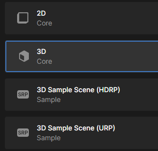
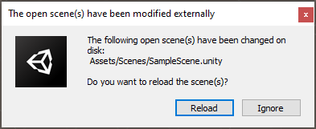

## Importing a Unity package

Open the Unity Hub, make sure that **Projects** is selected from the menu on the left, and then click on **New project**.

Choose **3D Core** from the next menu, then click the **Create project** button.

Import your downloaded package

Select the location of your downloaded package

Click on the **Import** button, to import all of the package.

You will need to **Reload** your scene to use the imported package.

